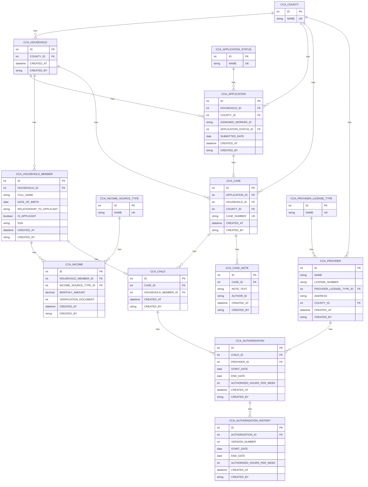

# Sample County Child Care Assistance: Entity Relationship Diagram

<!-- TEST FIXTURE: clean baseline v1 for erd-maintain testing. Synthetic data only.
     Built from the three sample sources S1–S3 listed in sources.md. Copy ERD.md and sources.md into examples/sample-project/erd/ before running /project-terrarium:erd-maintain. -->

| | |
|---|---|
| Version | 1 |
| Last updated | 2026-09-20 |
| Application prefix | CCA |
| Target database | Oracle |
| Sources | See `sources.md` (S1–S3) |
| Status | Draft |

## Summary
Models child care assistance from household application through case, child, provider and authorization, with authorization history and case notes. A child can hold authorizations with several providers at the same time. Co-payment tracking is unsettled (Q-1).

## Diagram

## Entities

### E-1 CCA Household (`CCA_HOUSEHOLD`)
- **Purpose:** The family unit applying for assistance (one per application)
- **Kind:** Core
- **Est. volume:** unknown
- **Sensitivity:** PII
- **Sources:** [S1 §Glossary] [S3 @00:01:02]

| Field | Column | Type | Req | Key | Description | Sources |
|---|---|---|---|---|---|---|
| id | ID | Integer | Y | PK | Surrogate key | CONVENTION |
| countyId | COUNTY_ID | Integer | Y | FK→E-14 | County that received the household's application | [S3 @00:01:02] |
| createdAt | CREATED_AT | Date and Time | Y |  | Row creation timestamp | CONVENTION |
| createdBy | CREATED_BY | User | Y |  | Row creator | CONVENTION |

### E-2 CCA Household Member (`CCA_HOUSEHOLD_MEMBER`)
- **Purpose:** A person in the household; the applicant is a member
- **Kind:** Core
- **Est. volume:** unknown
- **Sensitivity:** PII
- **Sources:** [S3 @00:02:10] [S2 §Eligibility inputs]

| Field | Column | Type | Req | Key | Description | Sources |
|---|---|---|---|---|---|---|
| id | ID | Integer | Y | PK | Surrogate key | CONVENTION |
| householdId | HOUSEHOLD_ID | Integer | Y | FK→E-1 | Owning household | [S3 @00:02:10] |
| fullName | FULL_NAME | Text(100) | Y |  | Member name | [S3 @00:02:10] |
| dateOfBirth | DATE_OF_BIRTH | Date | Y |  | Date of birth (restricted to eligibility workers) | [S3 @00:02:10] [S2 §Security] |
| relationshipToApplicant | RELATIONSHIP_TO_APPLICANT | Text(30) | Y |  | Relationship to the applicant | [S3 @00:02:10] |
| isApplicant | IS_APPLICANT | Boolean | Y |  | True for the adult who signs the application | [S1 §Glossary] |
| ssn | SSN | Text(11) | N |  | Applicant SSN (applicant only; restricted to eligibility workers) | [S3 @00:02:10] [S2 §Security] |
| createdAt | CREATED_AT | Date and Time | Y |  | Row creation timestamp | CONVENTION |
| createdBy | CREATED_BY | User | Y |  | Row creator | CONVENTION |

### E-3 CCA Application (`CCA_APPLICATION`)
- **Purpose:** A request for assistance submitted by a household
- **Kind:** Core
- **Est. volume:** 40,000 per year statewide
- **Sensitivity:** PII
- **Sources:** [S1 §Glossary] [S2 §Application lifecycle] [S3 @00:01:02]

| Field | Column | Type | Req | Key | Description | Sources |
|---|---|---|---|---|---|---|
| id | ID | Integer | Y | PK | Surrogate key | CONVENTION |
| householdId | HOUSEHOLD_ID | Integer | Y | FK→E-1 | Submitting household | [S3 @00:01:02] |
| countyId | COUNTY_ID | Integer | Y | FK→E-14 | County that received the application | [S3 @00:01:02] |
| assignedWorkerId | ASSIGNED_WORKER_ID | User | N |  | Worker the application is assigned to | [S3 @00:01:02] |
| applicationStatusId | APPLICATION_STATUS_ID | Integer | Y | FK→E-4 | Current lifecycle status | [S2 §Application lifecycle] |
| submittedDate | SUBMITTED_DATE | Date | Y |  | Date submitted | [S2 §Application lifecycle] |
| createdAt | CREATED_AT | Date and Time | Y |  | Row creation timestamp | CONVENTION |
| createdBy | CREATED_BY | User | Y |  | Row creator | CONVENTION |

### E-4 CCA Application Status (`CCA_APPLICATION_STATUS`)
- **Purpose:** Application lifecycle statuses
- **Kind:** Reference
- **Est. volume:** <10 rows
- **Sensitivity:** None
- **Sources:** [S2 §Application lifecycle]

| Field | Column | Type | Req | Key | Description | Sources |
|---|---|---|---|---|---|---|
| id | ID | Integer | Y | PK | Surrogate key | CONVENTION |
| name | NAME | Text(30) | Y | UK | Status name | [S2 §Application lifecycle] |

Seed values: Submitted, In Review, Pending Verification, Approved, Denied, Withdrawn.

### E-5 CCA Income (`CCA_INCOME`)
- **Purpose:** Monthly income of a household member by source
- **Kind:** Core
- **Est. volume:** unknown
- **Sensitivity:** PII
- **Sources:** [S3 @00:03:45] [S2 §Eligibility inputs]

| Field | Column | Type | Req | Key | Description | Sources |
|---|---|---|---|---|---|---|
| id | ID | Integer | Y | PK | Surrogate key | CONVENTION |
| householdMemberId | HOUSEHOLD_MEMBER_ID | Integer | Y | FK→E-2 | Member earning the income | [S3 @00:03:45] |
| incomeSourceTypeId | INCOME_SOURCE_TYPE_ID | Integer | Y | FK→E-6 | Income source | [S3 @00:03:45] |
| monthlyAmount | MONTHLY_AMOUNT | Decimal | Y |  | Monthly amount | [S3 @00:03:45] |
| verificationDocument | VERIFICATION_DOCUMENT | Document | N |  | Verification document | [S3 @00:03:45] |
| createdAt | CREATED_AT | Date and Time | Y |  | Row creation timestamp | CONVENTION |
| createdBy | CREATED_BY | User | Y |  | Row creator | CONVENTION |

### E-6 CCA Income Source Type (`CCA_INCOME_SOURCE_TYPE`)
- **Purpose:** Categories of income
- **Kind:** Reference
- **Est. volume:** <10 rows
- **Sensitivity:** None
- **Sources:** [S3 @00:03:45] [S2 §Eligibility inputs]

| Field | Column | Type | Req | Key | Description | Sources |
|---|---|---|---|---|---|---|
| id | ID | Integer | Y | PK | Surrogate key | CONVENTION |
| name | NAME | Text(30) | Y | UK | Source name | [S3 @00:03:45] |

Seed values: Wages, Self-employment, Child support, Other.

### E-7 CCA Case (`CCA_CASE`)
- **Purpose:** An approved, ongoing assistance authorization for a household
- **Kind:** Core
- **Est. volume:** <40,000 per year; retained 7 years after closure
- **Sensitivity:** PII
- **Sources:** [S1 §Glossary] [S2 §Application lifecycle] [S3 @00:05:12]

| Field | Column | Type | Req | Key | Description | Sources |
|---|---|---|---|---|---|---|
| id | ID | Integer | Y | PK | Surrogate key | CONVENTION |
| applicationId | APPLICATION_ID | Integer | Y | FK→E-3 | Approved application that created the case | [S2 §Application lifecycle] |
| householdId | HOUSEHOLD_ID | Integer | Y | FK→E-1 | Household served | [S1 §Glossary] |
| countyId | COUNTY_ID | Integer | Y | FK→E-14 | Owning county (drives record-level security) | [S2 §Security] |
| caseNumber | CASE_NUMBER | Text(20) | Y | UK | Human-facing case number | ASSUMPTION |
| createdAt | CREATED_AT | Date and Time | Y |  | Row creation timestamp | CONVENTION |
| createdBy | CREATED_BY | User | Y |  | Row creator | CONVENTION |

### E-8 CCA Child (`CCA_CHILD`)
- **Purpose:** A household member for whom care is requested
- **Kind:** Core
- **Est. volume:** unknown
- **Sensitivity:** PII
- **Sources:** [S1 §Glossary] [S3 @00:05:12]

| Field | Column | Type | Req | Key | Description | Sources |
|---|---|---|---|---|---|---|
| id | ID | Integer | Y | PK | Surrogate key | CONVENTION |
| caseId | CASE_ID | Integer | Y | FK→E-7 | Case the child is served under | [S3 @00:05:12] |
| householdMemberId | HOUSEHOLD_MEMBER_ID | Integer | Y | FK→E-2 | The member record for the child | [S1 §Glossary] |
| createdAt | CREATED_AT | Date and Time | Y |  | Row creation timestamp | CONVENTION |
| createdBy | CREATED_BY | User | Y |  | Row creator | CONVENTION |

### E-9 CCA Provider (`CCA_PROVIDER`)
- **Purpose:** A child care provider. A provider serves many children
- **Kind:** Core
- **Est. volume:** unknown
- **Sensitivity:** PII
- **Sources:** [S1 §Glossary] [S3 @00:05:12] [S3 @00:09:15]

| Field | Column | Type | Req | Key | Description | Sources |
|---|---|---|---|---|---|---|
| id | ID | Integer | Y | PK | Surrogate key | CONVENTION |
| name | NAME | Text(100) | Y |  | Provider name | [S3 @00:09:15] |
| licenseNumber | LICENSE_NUMBER | Text(20) | Y |  | License number | [S3 @00:09:15] |
| providerLicenseTypeId | PROVIDER_LICENSE_TYPE_ID | Integer | Y | FK→E-10 | License type | [S3 @00:09:15] |
| address | ADDRESS | Text(200) | Y |  | Provider address | [S3 @00:09:15] |
| countyId | COUNTY_ID | Integer | Y | FK→E-14 | Provider county | [S3 @00:09:15] |
| createdAt | CREATED_AT | Date and Time | Y |  | Row creation timestamp | CONVENTION |
| createdBy | CREATED_BY | User | Y |  | Row creator | CONVENTION |

### E-10 CCA Provider License Type (`CCA_PROVIDER_LICENSE_TYPE`)
- **Purpose:** Provider license types
- **Kind:** Reference
- **Est. volume:** <10 rows
- **Sensitivity:** None
- **Sources:** [S3 @00:09:15]

| Field | Column | Type | Req | Key | Description | Sources |
|---|---|---|---|---|---|---|
| id | ID | Integer | Y | PK | Surrogate key | CONVENTION |
| name | NAME | Text(40) | Y | UK | License type name | [S3 @00:09:15] |

Seed values: Licensed family, Licensed center, Legally non-licensed.

### E-11 CCA Authorization (`CCA_AUTHORIZATION`)
- **Purpose:** Approval for a child to receive care from a provider for a date range and weekly hours. A child may hold concurrent authorizations with several providers
- **Kind:** Core
- **Est. volume:** unknown
- **Sensitivity:** PII
- **Sources:** [S1 §Glossary] [S3 @00:05:12] [S3 @00:06:30]

| Field | Column | Type | Req | Key | Description | Sources |
|---|---|---|---|---|---|---|
| id | ID | Integer | Y | PK | Surrogate key | CONVENTION |
| childId | CHILD_ID | Integer | Y | FK→E-8 | Child receiving care | [S3 @00:05:12] |
| providerId | PROVIDER_ID | Integer | Y | FK→E-9 | Provider giving care | [S3 @00:05:12] |
| startDate | START_DATE | Date | Y |  | Start date | [S3 @00:06:30] |
| endDate | END_DATE | Date | N |  | End date | [S3 @00:06:30] |
| authorizedHoursPerWeek | AUTHORIZED_HOURS_PER_WEEK | Integer | Y |  | Authorized hours per week | [S3 @00:06:30] |
| createdAt | CREATED_AT | Date and Time | Y |  | Row creation timestamp | CONVENTION |
| createdBy | CREATED_BY | User | Y |  | Row creator | CONVENTION |

### E-12 CCA Authorization History (`CCA_AUTHORIZATION_HISTORY`)
- **Purpose:** Prior versions of an authorization, kept for auditors
- **Kind:** History/Audit
- **Est. volume:** hundreds of thousands (every revision)
- **Sensitivity:** PII
- **Sources:** [S3 @00:06:30]

| Field | Column | Type | Req | Key | Description | Sources |
|---|---|---|---|---|---|---|
| id | ID | Integer | Y | PK | Surrogate key | CONVENTION |
| authorizationId | AUTHORIZATION_ID | Integer | Y | FK→E-11 | Authorization that was revised | [S3 @00:06:30] |
| versionNumber | VERSION_NUMBER | Integer | Y |  | Version of the authorization | [S3 @00:06:30] |
| startDate | START_DATE | Date | Y |  | Start date at that version | [S3 @00:06:30] |
| endDate | END_DATE | Date | N |  | End date at that version | [S3 @00:06:30] |
| authorizedHoursPerWeek | AUTHORIZED_HOURS_PER_WEEK | Integer | Y |  | Hours at that version | [S3 @00:06:30] |
| createdAt | CREATED_AT | Date and Time | Y |  | Row creation timestamp | CONVENTION |
| createdBy | CREATED_BY | User | Y |  | Row creator | CONVENTION |

### E-13 CCA Case Note (`CCA_CASE_NOTE`)
- **Purpose:** Free-text note a worker writes on a case; notes can be several pages
- **Kind:** Core
- **Est. volume:** hundreds per busy case
- **Sensitivity:** PII
- **Sources:** [S3 @00:07:40]

| Field | Column | Type | Req | Key | Description | Sources |
|---|---|---|---|---|---|---|
| id | ID | Integer | Y | PK | Surrogate key | CONVENTION |
| caseId | CASE_ID | Integer | Y | FK→E-7 | Case the note belongs to | [S3 @00:07:40] |
| noteText | NOTE_TEXT | Extra Long Text | Y |  | Note body (several pages) | [S3 @00:07:40] |
| authorId | AUTHOR_ID | User | Y |  | Worker who wrote the note | [S3 @00:07:40] |
| createdAt | CREATED_AT | Date and Time | Y |  | Row creation timestamp | CONVENTION |
| createdBy | CREATED_BY | User | Y |  | Row creator | CONVENTION |

### E-14 CCA County (`CCA_COUNTY`)
- **Purpose:** Administering counties; workers see only their county
- **Kind:** Reference
- **Est. volume:** <100 rows
- **Sensitivity:** None
- **Sources:** [S1 §Glossary] [S2 §Security]

| Field | Column | Type | Req | Key | Description | Sources |
|---|---|---|---|---|---|---|
| id | ID | Integer | Y | PK | Surrogate key | CONVENTION |
| name | NAME | Text(50) | Y | UK | County name | [S1 §Glossary] |

## Relationships

| ID | From (many/child side) | To (one/parent side) | Cardinality | FK field | Description | Sources |
|---|---|---|---|---|---|---|
| R-1 | E-3 CCA Application | E-1 CCA Household | many-to-one | householdId | A household submits many applications | [S3 @00:01:02] |
| R-2 | E-2 CCA Household Member | E-1 CCA Household | many-to-one | householdId | A household has many members | [S3 @00:02:10] |
| R-3 | E-5 CCA Income | E-2 CCA Household Member | many-to-one | householdMemberId | A member has many income records | [S3 @00:03:45] |
| R-4 | E-5 CCA Income | E-6 CCA Income Source Type | many-to-one | incomeSourceTypeId | Each income record has one source type | [S3 @00:03:45] |
| R-5 | E-3 CCA Application | E-4 CCA Application Status | many-to-one | applicationStatusId | Each application has one status | [S2 §Application lifecycle] |
| R-6 | E-7 CCA Case | E-3 CCA Application | one-to-one | applicationId | An approved application creates one case | [S2 §Application lifecycle] |
| R-7 | E-8 CCA Child | E-7 CCA Case | many-to-one | caseId | A case covers one or more children | [S3 @00:05:12] |
| R-8 | E-11 CCA Authorization | E-8 CCA Child | many-to-one | childId | A child has many authorizations, so several providers can be active at once (no uniqueness on child + provider) | [S3 @00:05:12] |
| R-9 | E-11 CCA Authorization | E-9 CCA Provider | many-to-one | providerId | A provider serves many children through authorizations | [S3 @00:05:12] |
| R-10 | E-12 CCA Authorization History | E-11 CCA Authorization | many-to-one | authorizationId | An authorization has many history versions | [S3 @00:06:30] |
| R-11 | E-13 CCA Case Note | E-7 CCA Case | many-to-one | caseId | A case has many notes | [S3 @00:07:40] |
| R-12 | E-9 CCA Provider | E-10 CCA Provider License Type | many-to-one | providerLicenseTypeId | Each provider has one license type | [S3 @00:09:15] |
| R-13 | E-1 CCA Household | E-14 CCA County | many-to-one | countyId | A county has many households | [S3 @00:01:02] |
| R-14 | E-3 CCA Application | E-14 CCA County | many-to-one | countyId | A county receives many applications | [S3 @00:01:02] |
| R-15 | E-7 CCA Case | E-1 CCA Household | many-to-one | householdId | A household may have cases | [S1 §Glossary] |
| R-16 | E-7 CCA Case | E-14 CCA County | many-to-one | countyId | A county owns many cases (record-level security) | [S2 §Security] |
| R-17 | E-8 CCA Child | E-2 CCA Household Member | one-to-one | householdMemberId | A child is a household member | [S1 §Glossary] |
| R-18 | E-9 CCA Provider | E-14 CCA County | many-to-one | countyId | A county has many providers | [S3 @00:09:15] |

## Assumptions
| ID | Assumption | Affects | Why |
|---|---|---|---|
| A-1 | Cases carry a generated human-facing case number | E-7.caseNumber | Sources mention cases but give no numbering scheme |
| A-2 | A child is also a household member, so personal details live on the member row | E-8, E-2 | Glossary defines a child as a household member |
| A-3 | Audit fields (`createdAt`, `createdBy`) on transactional entities | all Core and History entities | Platform convention |

## Open questions
| ID | Question for stakeholders | Affects | Raised by |
|---|---|---|---|
| Q-1 | Is co-payment tracked per case or per authorization? | E-7, E-11 | [S3 @00:10:20] |

## Out of scope / deferred
- Activity of each adult (employment, education, job search): mentioned in the program overview, no detail yet [S2 §Eligibility inputs].

## Review responses
(none)

## Change log
| Version | Date | Change set | Summary |
|---|---|---|---|
| 1 | 2026-09-20 | full build | Initial model from S1–S3 |
