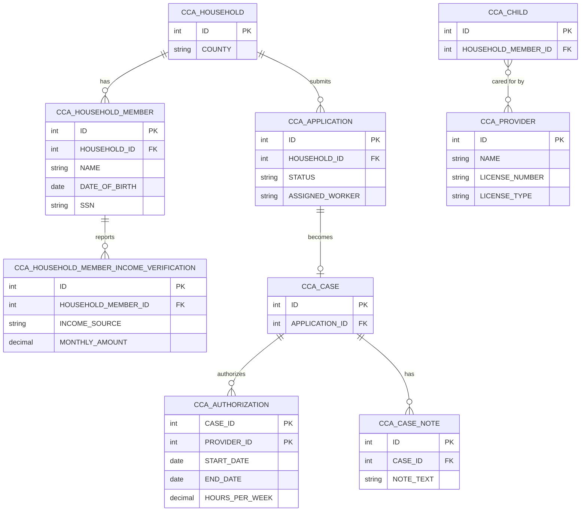

# Sample County Child Care Assistance: Entity Relationship Diagram

<!-- TEST FIXTURE: contains deliberate defects for testing appian-erd-reviewer.
     Expected findings (at minimum):
       1. CCA_AUTHORIZATION uses a composite primary key (caseId + providerId)          -> Keys
       2. CCA_HOUSEHOLD_MEMBER_INCOME_VERIFICATION is 40 chars on an Oracle target      -> Naming/Limits
       3. CCA_APPLICATION.status is a Text enumeration with 6 values                    -> Normalization
       4. CCA_CHILD <-> CCA_PROVIDER modeled as direct many-to-many                     -> Relationships
       5. SSN / DOB on CCA_HOUSEHOLD_MEMBER marked Sensitivity: None                    -> Security
       6. CCA_CASE_NOTE.noteText is Text (notes are "several pages")                     -> Naming/Limits
-->

| | |
|---|---|
| Version | 1 |
| Last updated | 2026-10-08 |
| Application prefix | CCA |
| Target database | Oracle |
| Sources | See `sources-manifest.md` for run 2026-10-08 (S1–S3) |
| Status | Draft |

## Summary
Models child care assistance applications, households, cases, providers, and authorizations.

## Diagram

## Entities

### E-1 CCA Household (`CCA_HOUSEHOLD`)
- **Purpose:** The family unit applying for assistance.
- **Kind:** Core
- **Est. volume:** unknown
- **Sensitivity:** None
- **Sources:** [S1 §Household] [S3 @00:01:02]

| Field | Column | Type | Req | Key | Description | Sources |
|---|---|---|---|---|---|---|
| id | ID | Integer | Y | PK | Surrogate key | CONVENTION |
| county | COUNTY | Text | Y | | Administering county | [S3 @00:01:02] |

### E-2 CCA Application (`CCA_APPLICATION`)
- **Purpose:** A household's request for assistance.
- **Kind:** Core
- **Est. volume:** 40,000/yr
- **Sensitivity:** None
- **Sources:** [S1 §Application] [S2 §Application lifecycle]

| Field | Column | Type | Req | Key | Description | Sources |
|---|---|---|---|---|---|---|
| id | ID | Integer | Y | PK | Surrogate key | CONVENTION |
| householdId | HOUSEHOLD_ID | Integer | Y | FK→E-1 | Applying household | [S3 @00:01:02] |
| status | STATUS | Text | Y | | Submitted, In Review, Pending Verification, Approved, Denied, Withdrawn | [S2 §Application lifecycle] |
| assignedWorker | ASSIGNED_WORKER | Text | N | | Worker username | [S3 @00:01:02] |

### E-3 CCA Household Member (`CCA_HOUSEHOLD_MEMBER`)
- **Purpose:** A person in the household.
- **Kind:** Core
- **Est. volume:** unknown
- **Sensitivity:** None
- **Sources:** [S3 @00:02:10]

| Field | Column | Type | Req | Key | Description | Sources |
|---|---|---|---|---|---|---|
| id | ID | Integer | Y | PK | Surrogate key | CONVENTION |
| householdId | HOUSEHOLD_ID | Integer | Y | FK→E-1 | Household | [S3 @00:02:10] |
| name | NAME | Text | Y | | Full name | [S3 @00:02:10] |
| dateOfBirth | DATE_OF_BIRTH | Date | Y | | Date of birth | [S3 @00:02:10] |
| ssn | SSN | Text | N | | Applicant SSN | [S3 @00:02:10] |

### E-4 CCA Household Member Income Verification (`CCA_HOUSEHOLD_MEMBER_INCOME_VERIFICATION`)
- **Purpose:** Monthly income by member and source.
- **Kind:** Core
- **Est. volume:** unknown
- **Sensitivity:** PII
- **Sources:** [S3 @00:03:45]

| Field | Column | Type | Req | Key | Description | Sources |
|---|---|---|---|---|---|---|
| id | ID | Integer | Y | PK | Surrogate key | CONVENTION |
| householdMemberId | HOUSEHOLD_MEMBER_ID | Integer | Y | FK→E-3 | Member | [S3 @00:03:45] |
| incomeSource | INCOME_SOURCE | Text | Y | | Wages, self-employment, child support, other | [S3 @00:03:45] |
| monthlyAmount | MONTHLY_AMOUNT | Decimal | Y | | Monthly amount | [S3 @00:03:45] |

### E-5 CCA Case (`CCA_CASE`)
- **Purpose:** Approved ongoing assistance.
- **Kind:** Core
- **Est. volume:** unknown
- **Sensitivity:** None
- **Sources:** [S3 @00:05:12]

| Field | Column | Type | Req | Key | Description | Sources |
|---|---|---|---|---|---|---|
| id | ID | Integer | Y | PK | Surrogate key | CONVENTION |
| applicationId | APPLICATION_ID | Integer | Y | FK→E-2 | Originating application | [S3 @00:05:12] |

### E-6 CCA Authorization (`CCA_AUTHORIZATION`)
- **Purpose:** Approved care for a case with a provider.
- **Kind:** Core
- **Est. volume:** unknown
- **Sensitivity:** None
- **Sources:** [S3 @00:06:30]

| Field | Column | Type | Req | Key | Description | Sources |
|---|---|---|---|---|---|---|
| caseId | CASE_ID | Integer | Y | PK, FK→E-5 | Case | [S3 @00:06:30] |
| providerId | PROVIDER_ID | Integer | Y | PK, FK→E-9 | Provider | [S3 @00:06:30] |
| startDate | START_DATE | Date | Y | | Start | [S3 @00:06:30] |
| endDate | END_DATE | Date | Y | | End | [S3 @00:06:30] |
| hoursPerWeek | HOURS_PER_WEEK | Decimal | Y | | Authorized hours | [S3 @00:06:30] |

### E-7 CCA Case Note (`CCA_CASE_NOTE`)
- **Purpose:** Worker notes on a case.
- **Kind:** Core
- **Est. volume:** unknown
- **Sensitivity:** None
- **Sources:** [S3 @00:07:40]

| Field | Column | Type | Req | Key | Description | Sources |
|---|---|---|---|---|---|---|
| id | ID | Integer | Y | PK | Surrogate key | CONVENTION |
| caseId | CASE_ID | Integer | Y | FK→E-5 | Case | [S3 @00:07:40] |
| noteText | NOTE_TEXT | Text | Y | | Note body | [S3 @00:07:40] |

### E-8 CCA Child (`CCA_CHILD`)
- **Purpose:** Household member receiving care.
- **Kind:** Core
- **Est. volume:** unknown
- **Sensitivity:** None
- **Sources:** [S1 §Child]

| Field | Column | Type | Req | Key | Description | Sources |
|---|---|---|---|---|---|---|
| id | ID | Integer | Y | PK | Surrogate key | CONVENTION |
| householdMemberId | HOUSEHOLD_MEMBER_ID | Integer | Y | FK→E-3 | Member | [S1 §Child] |

### E-9 CCA Provider (`CCA_PROVIDER`)
- **Purpose:** Child care provider.
- **Kind:** Core
- **Est. volume:** unknown
- **Sensitivity:** None
- **Sources:** [S3 @00:09:15]

| Field | Column | Type | Req | Key | Description | Sources |
|---|---|---|---|---|---|---|
| id | ID | Integer | Y | PK | Surrogate key | CONVENTION |
| name | NAME | Text | Y | | Provider name | [S3 @00:09:15] |
| licenseNumber | LICENSE_NUMBER | Text | N | | License number | [S3 @00:09:15] |
| licenseType | LICENSE_TYPE | Text | Y | | Licensed family, licensed center, legally non-licensed | [S3 @00:09:15] |

## Relationships

| ID | From (many/child side) | To (one/parent side) | Cardinality | FK field | Description | Sources |
|---|---|---|---|---|---|---|
| R-1 | E-2 CCA Application | E-1 CCA Household | many-to-one | householdId | Household submits applications | [S3 @00:01:02] |
| R-2 | E-3 CCA Household Member | E-1 CCA Household | many-to-one | householdId | Household has members | [S3 @00:02:10] |
| R-3 | E-4 Income Verification | E-3 CCA Household Member | many-to-one | householdMemberId | Member reports income | [S3 @00:03:45] |
| R-4 | E-5 CCA Case | E-2 CCA Application | one-to-one | applicationId | Approved application becomes case | [S3 @00:05:12] |
| R-5 | E-6 CCA Authorization | E-5 CCA Case | many-to-one | caseId | Case has authorizations | [S3 @00:06:30] |
| R-6 | E-7 CCA Case Note | E-5 CCA Case | many-to-one | caseId | Case has notes | [S3 @00:07:40] |
| R-7 | E-8 CCA Child | E-9 CCA Provider | many-to-many | — | Children cared for by providers | [S3 @00:05:12] |

## Assumptions
| ID | Assumption | Affects | Why |
|---|---|---|---|

## Open questions
| ID | Question for stakeholders | Affects | Raised by |
|---|---|---|---|
| Q-1 | Is co-payment tracked per case or per authorization? | E-5, E-6 | [S3 @00:10:20] |

## Out of scope / deferred
- None.
