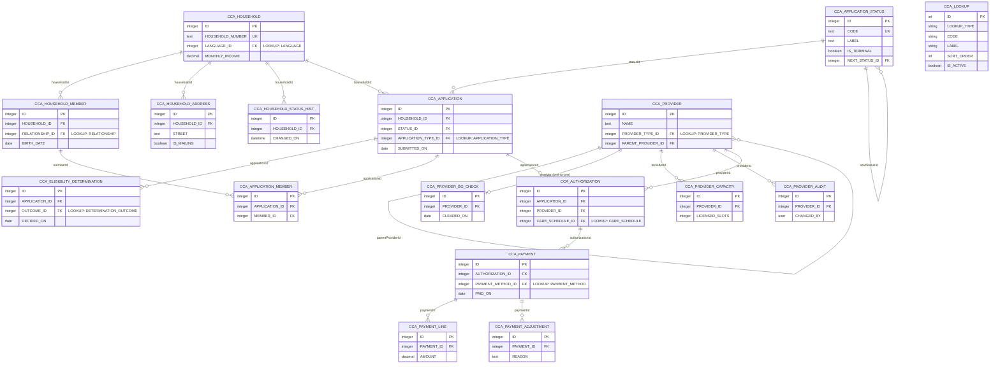

# Sample County Child Care Assistance: Entity Relationship Diagram (grouped)

| | |
|---|---|
| Version | 1 |
| Last updated | 2026-10-08 |
| Application prefix | CCA |
| Target database | Oracle |
| Sources | See `sources.md` (S1) |
| Status | Draft |

## Summary
Synthetic child care assistance model used to test the ERD viewer: households apply, are determined eligible, are authorized for care at a provider and are paid. Four groups, one shared lookup table, one open question about care schedules.

## Groups

| Order | Group | Description |
|---|---|---|
| 1 | Household | The family unit, its members and addresses |
| 2 | Application & Eligibility | Requests for assistance and their determinations |
| 3 | Provider | Child care providers and their capacity |
| 4 | Authorization & Payment | Approved care and what is paid for it |

## Diagram

## Entities

### E-1 CCA Household (`CCA_HOUSEHOLD`)
- **Purpose:** Family unit applying for assistance.
- **Kind:** Core
- **Group:** Household
- **Est. volume:** unknown
- **Sensitivity:** PII
- **Sources:** [S1 §Model]

| Field | Column | Type | Req | Key | Description | Sources |
|---|---|---|---|---|---|---|
| id | ID | Integer | Y | PK | Surrogate key | CONVENTION |
| householdNumber | HOUSEHOLD_NUMBER | Text(20) | Y | UK | Human-facing number | CONVENTION |
| languageId | LANGUAGE_ID | Integer | Y | FK→LOOKUP:LANGUAGE | Preferred language | CONVENTION |
| monthlyIncome | MONTHLY_INCOME | Decimal | N |  | Reported income | CONVENTION |
| createdAt | CREATED_AT | Date and Time | Y |  | Audit | CONVENTION |
| createdBy | CREATED_BY | User | Y |  | Audit | CONVENTION |

### E-2 CCA Household Member (`CCA_HOUSEHOLD_MEMBER`)
- **Purpose:** A person in a household.
- **Kind:** Core
- **Group:** Household
- **Est. volume:** unknown
- **Sensitivity:** PII
- **Sources:** [S1 §Model]

| Field | Column | Type | Req | Key | Description | Sources |
|---|---|---|---|---|---|---|
| id | ID | Integer | Y | PK | Surrogate key | CONVENTION |
| householdId | HOUSEHOLD_ID | Integer | Y | FK→E-1 | Owning household | CONVENTION |
| relationshipId | RELATIONSHIP_ID | Integer | Y | FK→LOOKUP:RELATIONSHIP | Relationship to head | CONVENTION |
| birthDate | BIRTH_DATE | Date | Y |  | Date of birth | CONVENTION |
| createdAt | CREATED_AT | Date and Time | Y |  | Audit | CONVENTION |
| createdBy | CREATED_BY | User | Y |  | Audit | CONVENTION |

### E-3 CCA Household Address (`CCA_HOUSEHOLD_ADDRESS`)
- **Purpose:** Mailing and residence addresses.
- **Kind:** Core
- **Group:** Household
- **Est. volume:** unknown
- **Sensitivity:** PII
- **Sources:** [S1 §Model]

| Field | Column | Type | Req | Key | Description | Sources |
|---|---|---|---|---|---|---|
| id | ID | Integer | Y | PK | Surrogate key | CONVENTION |
| householdId | HOUSEHOLD_ID | Integer | Y | FK→E-1 | Owning household | CONVENTION |
| street | STREET | Text(120) | Y |  | Street line | CONVENTION |
| isMailing | IS_MAILING | Boolean | Y |  | Mailing address flag | CONVENTION |
| createdAt | CREATED_AT | Date and Time | Y |  | Audit | CONVENTION |
| createdBy | CREATED_BY | User | Y |  | Audit | CONVENTION |

### E-4 CCA Household Status History (`CCA_HOUSEHOLD_STATUS_HIST`)
- **Purpose:** Point-in-time record of household status changes.
- **Kind:** History/Audit
- **Group:** Household
- **Est. volume:** unknown
- **Sensitivity:** None
- **Sources:** [S1 §Model]

| Field | Column | Type | Req | Key | Description | Sources |
|---|---|---|---|---|---|---|
| id | ID | Integer | Y | PK | Surrogate key | CONVENTION |
| householdId | HOUSEHOLD_ID | Integer | Y | FK→E-1 | Owning household | CONVENTION |
| changedOn | CHANGED_ON | Date and Time | Y |  | When it changed | CONVENTION |
| createdAt | CREATED_AT | Date and Time | Y |  | Audit | CONVENTION |
| createdBy | CREATED_BY | User | Y |  | Audit | CONVENTION |

### E-5 CCA Application (`CCA_APPLICATION`)
- **Purpose:** A request for child care assistance.
- **Kind:** Core
- **Group:** Application & Eligibility
- **Est. volume:** unknown
- **Sensitivity:** PII
- **Sources:** [S1 §Model]

| Field | Column | Type | Req | Key | Description | Sources |
|---|---|---|---|---|---|---|
| id | ID | Integer | Y | PK | Surrogate key | CONVENTION |
| householdId | HOUSEHOLD_ID | Integer | Y | FK→E-1 | Applying household | CONVENTION |
| statusId | STATUS_ID | Integer | Y | FK→E-8 | Current status | CONVENTION |
| typeId | APPLICATION_TYPE_ID | Integer | Y | FK→LOOKUP:APPLICATION_TYPE | Initial, renewal or change | CONVENTION |
| submittedOn | SUBMITTED_ON | Date | Y |  | Submission date | CONVENTION |
| createdAt | CREATED_AT | Date and Time | Y |  | Audit | CONVENTION |
| createdBy | CREATED_BY | User | Y |  | Audit | CONVENTION |

### E-6 CCA Eligibility Determination (`CCA_ELIGIBILITY_DETERMINATION`)
- **Purpose:** Outcome of evaluating an application.
- **Kind:** Core
- **Group:** Application & Eligibility
- **Est. volume:** unknown
- **Sensitivity:** PII
- **Sources:** [S1 §Model]

| Field | Column | Type | Req | Key | Description | Sources |
|---|---|---|---|---|---|---|
| id | ID | Integer | Y | PK | Surrogate key | CONVENTION |
| applicationId | APPLICATION_ID | Integer | Y | FK→E-5 | Evaluated application | CONVENTION |
| outcomeId | OUTCOME_ID | Integer | Y | FK→LOOKUP:DETERMINATION_OUTCOME | Approved or denied | CONVENTION |
| decidedOn | DECIDED_ON | Date | Y |  | Decision date | CONVENTION |
| createdAt | CREATED_AT | Date and Time | Y |  | Audit | CONVENTION |
| createdBy | CREATED_BY | User | Y |  | Audit | CONVENTION |

### E-7 CCA Application Member (`CCA_APPLICATION_MEMBER`)
- **Purpose:** Links an application to the members it covers.
- **Kind:** Junction
- **Group:** Application & Eligibility
- **Est. volume:** unknown
- **Sensitivity:** PII
- **Sources:** [S1 §Model]

| Field | Column | Type | Req | Key | Description | Sources |
|---|---|---|---|---|---|---|
| id | ID | Integer | Y | PK | Surrogate key | CONVENTION |
| applicationId | APPLICATION_ID | Integer | Y | FK→E-5 | Application | CONVENTION |
| memberId | MEMBER_ID | Integer | Y | FK→E-2 | Covered member | CONVENTION |
| createdAt | CREATED_AT | Date and Time | Y |  | Audit | CONVENTION |
| createdBy | CREATED_BY | User | Y |  | Audit | CONVENTION |

### E-8 CCA Application Status (`CCA_APPLICATION_STATUS`)
- **Purpose:** Status values with allowed transitions and a terminal flag, so it cannot live in CCA_LOOKUP.
- **Kind:** Reference
- **Group:** Application & Eligibility
- **Est. volume:** unknown
- **Sensitivity:** None
- **Sources:** [S1 §Model]

| Field | Column | Type | Req | Key | Description | Sources |
|---|---|---|---|---|---|---|
| id | ID | Integer | Y | PK | Surrogate key | CONVENTION |
| code | CODE | Text(20) | Y | UK | Status code | CONVENTION |
| label | LABEL | Text(60) | Y |  | Display label | CONVENTION |
| isTerminal | IS_TERMINAL | Boolean | Y |  | No further transitions | CONVENTION |
| nextStatusId | NEXT_STATUS_ID | Integer | N | FK→E-8 | Allowed next status | CONVENTION |
| createdAt | CREATED_AT | Date and Time | Y |  | Audit | CONVENTION |
| createdBy | CREATED_BY | User | Y |  | Audit | CONVENTION |

### E-9 CCA Provider (`CCA_PROVIDER`)
- **Purpose:** A licensed or registered care provider.
- **Kind:** Core
- **Group:** Provider
- **Est. volume:** unknown
- **Sensitivity:** None
- **Sources:** [S1 §Model]

| Field | Column | Type | Req | Key | Description | Sources |
|---|---|---|---|---|---|---|
| id | ID | Integer | Y | PK | Surrogate key | CONVENTION |
| name | NAME | Text(120) | Y |  | Provider name | CONVENTION |
| typeId | PROVIDER_TYPE_ID | Integer | Y | FK→LOOKUP:PROVIDER_TYPE | Center, family home, ... | CONVENTION |
| parentProviderId | PARENT_PROVIDER_ID | Integer | N | FK→E-9 | Owning organization | CONVENTION |
| createdAt | CREATED_AT | Date and Time | Y |  | Audit | CONVENTION |
| createdBy | CREATED_BY | User | Y |  | Audit | CONVENTION |

### E-10 CCA Provider Background Check (`CCA_PROVIDER_BG_CHECK`)
- **Purpose:** The single current background check for a provider.
- **Kind:** Core
- **Group:** Provider
- **Est. volume:** unknown
- **Sensitivity:** PII
- **Sources:** [S1 §Model]

| Field | Column | Type | Req | Key | Description | Sources |
|---|---|---|---|---|---|---|
| id | ID | Integer | Y | PK | Surrogate key | CONVENTION |
| providerId | PROVIDER_ID | Integer | Y | FK→E-9 | Provider (one-to-one) | CONVENTION |
| clearedOn | CLEARED_ON | Date | N |  | Clearance date | CONVENTION |
| createdAt | CREATED_AT | Date and Time | Y |  | Audit | CONVENTION |
| createdBy | CREATED_BY | User | Y |  | Audit | CONVENTION |

### E-11 CCA Provider Capacity (`CCA_PROVIDER_CAPACITY`)
- **Purpose:** Licensed slots per provider.
- **Kind:** Core
- **Group:** Provider
- **Est. volume:** unknown
- **Sensitivity:** None
- **Sources:** [S1 §Model]

| Field | Column | Type | Req | Key | Description | Sources |
|---|---|---|---|---|---|---|
| id | ID | Integer | Y | PK | Surrogate key | CONVENTION |
| providerId | PROVIDER_ID | Integer | Y | FK→E-9 | Provider | CONVENTION |
| licensedSlots | LICENSED_SLOTS | Integer | Y |  | Licensed slots | CONVENTION |
| createdAt | CREATED_AT | Date and Time | Y |  | Audit | CONVENTION |
| createdBy | CREATED_BY | User | Y |  | Audit | CONVENTION |

### E-12 CCA Provider Audit Log (`CCA_PROVIDER_AUDIT`)
- **Purpose:** Who changed a provider record and when.
- **Kind:** History/Audit
- **Group:** Provider
- **Est. volume:** unknown
- **Sensitivity:** None
- **Sources:** [S1 §Model]

| Field | Column | Type | Req | Key | Description | Sources |
|---|---|---|---|---|---|---|
| id | ID | Integer | Y | PK | Surrogate key | CONVENTION |
| providerId | PROVIDER_ID | Integer | Y | FK→E-9 | Provider | CONVENTION |
| changedBy | CHANGED_BY | User | Y |  | Editor | CONVENTION |
| createdAt | CREATED_AT | Date and Time | Y |  | Audit | CONVENTION |
| createdBy | CREATED_BY | User | Y |  | Audit | CONVENTION |

### E-13 CCA Authorization (`CCA_AUTHORIZATION`)
- **Purpose:** Approved child care for a child at a provider.
- **Kind:** Core
- **Group:** Authorization & Payment
- **Est. volume:** unknown
- **Sensitivity:** None
- **Sources:** [S1 §Model]

| Field | Column | Type | Req | Key | Description | Sources |
|---|---|---|---|---|---|---|
| id | ID | Integer | Y | PK | Surrogate key | CONVENTION |
| applicationId | APPLICATION_ID | Integer | Y | FK→E-5 | Approved application | CONVENTION |
| providerId | PROVIDER_ID | Integer | N | FK→E-9 | Chosen provider (optional until selected) | CONVENTION |
| scheduleId | CARE_SCHEDULE_ID | Integer | Y | FK→LOOKUP:CARE_SCHEDULE | Part time or full time | CONVENTION |
| createdAt | CREATED_AT | Date and Time | Y |  | Audit | CONVENTION |
| createdBy | CREATED_BY | User | Y |  | Audit | CONVENTION |

### E-14 CCA Payment (`CCA_PAYMENT`)
- **Purpose:** A payment issued to a provider.
- **Kind:** Core
- **Group:** Authorization & Payment
- **Est. volume:** unknown
- **Sensitivity:** None
- **Sources:** [S1 §Model]

| Field | Column | Type | Req | Key | Description | Sources |
|---|---|---|---|---|---|---|
| id | ID | Integer | Y | PK | Surrogate key | CONVENTION |
| authorizationId | AUTHORIZATION_ID | Integer | Y | FK→E-13 | Authorization paid against | CONVENTION |
| methodId | PAYMENT_METHOD_ID | Integer | Y | FK→LOOKUP:PAYMENT_METHOD | Check or EFT | CONVENTION |
| paidOn | PAID_ON | Date | N |  | Payment date | CONVENTION |
| createdAt | CREATED_AT | Date and Time | Y |  | Audit | CONVENTION |
| createdBy | CREATED_BY | User | Y |  | Audit | CONVENTION |

### E-15 CCA Payment Line (`CCA_PAYMENT_LINE`)
- **Purpose:** One billed child and period within a payment.
- **Kind:** Core
- **Group:** Authorization & Payment
- **Est. volume:** unknown
- **Sensitivity:** None
- **Sources:** [S1 §Model]

| Field | Column | Type | Req | Key | Description | Sources |
|---|---|---|---|---|---|---|
| id | ID | Integer | Y | PK | Surrogate key | CONVENTION |
| paymentId | PAYMENT_ID | Integer | Y | FK→E-14 | Payment | CONVENTION |
| amount | AMOUNT | Decimal | Y |  | Line amount | CONVENTION |
| createdAt | CREATED_AT | Date and Time | Y |  | Audit | CONVENTION |
| createdBy | CREATED_BY | User | Y |  | Audit | CONVENTION |

### E-16 CCA Payment Adjustment (`CCA_PAYMENT_ADJUSTMENT`)
- **Purpose:** Corrections applied after a payment was issued.
- **Kind:** History/Audit
- **Group:** Authorization & Payment
- **Est. volume:** unknown
- **Sensitivity:** None
- **Sources:** [S1 §Model]

| Field | Column | Type | Req | Key | Description | Sources |
|---|---|---|---|---|---|---|
| id | ID | Integer | Y | PK | Surrogate key | CONVENTION |
| paymentId | PAYMENT_ID | Integer | Y | FK→E-14 | Payment | CONVENTION |
| reason | REASON | Text(200) | Y |  | Why it was adjusted | CONVENTION |
| createdAt | CREATED_AT | Date and Time | Y |  | Audit | CONVENTION |
| createdBy | CREATED_BY | User | Y |  | Audit | CONVENTION |

### E-17 CCA Lookup (`CCA_LOOKUP`)
- **Purpose:** Single shared code list for every enumeration with three or more values.
- **Kind:** Lookup
- **Est. volume:** unknown
- **Sensitivity:** None
- **Sources:** [S1 §Model]

| Field | Column | Type | Req | Key | Description | Sources |
|---|---|---|---|---|---|---|
| id | ID | Integer | Y | PK | Surrogate key | CONVENTION |
| lookupType | LOOKUP_TYPE | Text(40) | Y |  | Code-list name | CONVENTION |
| code | CODE | Text(40) | Y |  | Code | CONVENTION |
| label | LABEL | Text(100) | Y |  | Display label | CONVENTION |
| sortOrder | SORT_ORDER | Integer | N |  | Display order | CONVENTION |
| isActive | IS_ACTIVE | Boolean | Y |  | Active flag | CONVENTION |
| createdAt | CREATED_AT | Date and Time | Y |  | Audit | CONVENTION |
| createdBy | CREATED_BY | User | Y |  | Audit | CONVENTION |

**LANGUAGE**

| CODE | LABEL |
|---|---|
| EN | En |
| ES | Es |
| SO | So |
| HMN | Hmn |

**RELATIONSHIP**

| CODE | LABEL |
|---|---|
| SELF | Self |
| CHILD | Child |
| SPOUSE | Spouse |
| OTHER | Other |

**APPLICATION_TYPE**

| CODE | LABEL |
|---|---|
| INITIAL | Initial |
| RENEWAL | Renewal |
| CHANGE | Change |

**DETERMINATION_OUTCOME**

| CODE | LABEL |
|---|---|
| APPROVED | Approved |
| DENIED | Denied |
| PENDED | Pended |

**PROVIDER_TYPE**

| CODE | LABEL |
|---|---|
| CENTER | Center |
| FAMILY | Family |
| LEGAL_NONLICENSED | Legal Nonlicensed |

**PAYMENT_METHOD**

| CODE | LABEL |
|---|---|
| CHECK | Check |
| EFT | Eft |
| CARD | Card |

## Relationships

| ID | From (many/child side) | To (one/parent side) | Cardinality | FK field | Description | Sources |
|---|---|---|---|---|---|---|
| R-1 | E-1 CCA Household | E-17 CCA Lookup | many-to-one | languageId | Code from LANGUAGE | CONVENTION |
| R-2 | E-2 CCA Household Member | E-1 CCA Household | many-to-one | householdId | Owning household | CONVENTION |
| R-3 | E-2 CCA Household Member | E-17 CCA Lookup | many-to-one | relationshipId | Code from RELATIONSHIP | CONVENTION |
| R-4 | E-3 CCA Household Address | E-1 CCA Household | many-to-one | householdId | Owning household | CONVENTION |
| R-5 | E-4 CCA Household Status History | E-1 CCA Household | many-to-one | householdId | Owning household | CONVENTION |
| R-6 | E-5 CCA Application | E-1 CCA Household | many-to-one | householdId | Applying household | CONVENTION |
| R-7 | E-5 CCA Application | E-8 CCA Application Status | many-to-one | statusId | Current status | CONVENTION |
| R-8 | E-5 CCA Application | E-17 CCA Lookup | many-to-one | typeId | Code from APPLICATION_TYPE | CONVENTION |
| R-9 | E-6 CCA Eligibility Determination | E-5 CCA Application | many-to-one | applicationId | Evaluated application | CONVENTION |
| R-10 | E-6 CCA Eligibility Determination | E-17 CCA Lookup | many-to-one | outcomeId | Code from DETERMINATION_OUTCOME | CONVENTION |
| R-11 | E-7 CCA Application Member | E-2 CCA Household Member | many-to-one | memberId | Covered member | CONVENTION |
| R-12 | E-7 CCA Application Member | E-5 CCA Application | many-to-one | applicationId | Application | CONVENTION |
| R-13 | E-8 CCA Application Status | E-8 CCA Application Status | many-to-one | nextStatusId | Allowed next status | CONVENTION |
| R-14 | E-9 CCA Provider | E-9 CCA Provider | many-to-one | parentProviderId | Owning organization | CONVENTION |
| R-15 | E-9 CCA Provider | E-17 CCA Lookup | many-to-one | typeId | Code from PROVIDER_TYPE | CONVENTION |
| R-16 | E-10 CCA Provider Background Check | E-9 CCA Provider | one-to-one | providerId | Provider (one-to-one) | CONVENTION |
| R-17 | E-11 CCA Provider Capacity | E-9 CCA Provider | many-to-one | providerId | Provider | CONVENTION |
| R-18 | E-12 CCA Provider Audit Log | E-9 CCA Provider | many-to-one | providerId | Provider | CONVENTION |
| R-19 | E-13 CCA Authorization | E-5 CCA Application | many-to-one | applicationId | Approved application | CONVENTION |
| R-20 | E-13 CCA Authorization | E-9 CCA Provider | many-to-one | providerId | Chosen provider (optional until selected) | CONVENTION |
| R-21 | E-13 CCA Authorization | E-17 CCA Lookup | many-to-one | scheduleId | Code from CARE_SCHEDULE | CONVENTION |
| R-22 | E-14 CCA Payment | E-13 CCA Authorization | many-to-one | authorizationId | Authorization paid against | CONVENTION |
| R-23 | E-14 CCA Payment | E-17 CCA Lookup | many-to-one | methodId | Code from PAYMENT_METHOD | CONVENTION |
| R-24 | E-15 CCA Payment Line | E-14 CCA Payment | many-to-one | paymentId | Payment | CONVENTION |
| R-25 | E-16 CCA Payment Adjustment | E-14 CCA Payment | many-to-one | paymentId | Payment | CONVENTION |

## Assumptions
| ID | Assumption | Affects | Why |
|---|---|---|---|
| A-1 | One current background check per provider | E-10 | Modeled one-to-one |

## Open questions
| ID | Question for stakeholders | Affects | Raised by |
|---|---|---|---|
| Q-1 | What are the allowed CARE_SCHEDULE values? (no seed values yet) | E-13 | analyst |

## Out of scope / deferred
- Child-level attendance tracking.

## Change log
| Version | Date | Change set | Summary |
|---|---|---|---|
| 1 | 2026-10-08 | full build | Initial grouped model |
