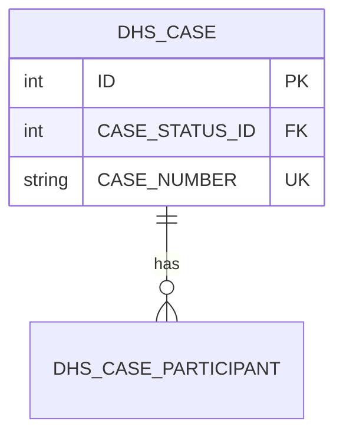

# ERD.md format (the contract)

`ERD.md` is the canonical, git-tracked data model for the project. The `erd-analyst` writes it,
the `appian-erd-reviewer` reads it, and `erd-maintain` diffs new sources against it and edits it only through accepted change sets. Follow this
structure exactly: section order, heading text, and table columns are what later runs parse.

## Rules

- **Logical model, Appian-shaped.** Model entities as they will become Appian record types
  backed by database tables. Follow the naming conventions below.
- **Every entity, field, and relationship carries a citation.** A citation is a source id from
  the source ledger (`sources.md`, next to `ERD.md`) plus a locator. Citations resolve against the
  ledger, never against a per-run manifest. Multiple citations are space-separated. Source IDs are
  permanent: a superseded source keeps its ID, so old citations stay valid.
- **No citation means it's an assumption.** If you add something the sources don't support
  (audit fields, a reference table implied by "status"), cite `ASSUMPTION` and list it under
  *Assumptions*. Standard platform fields (`id`, audit fields) may cite `CONVENTION`.
- **Never put PII/PHI values in the ERD.** Describe fields (e.g. "client SSN"), never example
  data from transcripts.
- **Never delete; deprecate.** Retired entities, fields, relationships, assumptions and questions
  stay in the document and are marked per *Deprecation* below.
- **Stable IDs.** Each entity has an ID `E-<n>`, each relationship `R-<n>`, each question
  `Q-<n>`, each assumption `A-<n>`. Never renumber existing IDs; append new ones.

## Citation forms

| Form | Used for |
|---|---|
| `[S<n> @HH:MM:SS]` | transcript, by timestamp |
| `[S<n> §Section]` | document, by section |
| `[S<n> slide <k>]` | slide deck, by 1-based slide number |
| `ASSUMPTION` / `CONVENTION` | no source (see above) |

## Deprecation

Nothing is ever deleted.

- **Entity:** keep its section. Add the bullet `- **Status:** Deprecated in v<n>: <reason> [cite]`
  under Sources. Remove it from the Mermaid diagram. Add a bullet to *Out of scope / deferred*.
- **Field:** keep the row. Set Req to `—` and prefix the Description with `DEPRECATED v<n>:`.
  Remove it from the Mermaid entity block.
- **Relationship:** keep the row. Prefix its Description with `DEPRECATED v<n>:`. Remove it from
  Mermaid.
- **Assumption confirmed by a source:** keep the `A-n` row. Append ` — confirmed [S<n> …] v<n>`
  to *Why*. Replace `ASSUMPTION` with the source citation on the affected elements.
- **Question resolved:** keep the `Q-n` row. Append ` — **Resolved v<n>:** <answer> [S<n> …]` to
  the Question cell.

## Naming conventions

Use these unless the project config or a context MD file says otherwise. If they conflict, follow the project and note it.

| Thing | Convention | Example |
|---|---|---|
| Table | `<PREFIX>_<ENTITY>`, UPPER_SNAKE, singular, ≤30 chars if DB is Oracle | `DHS_CASE` |
| Column | UPPER_SNAKE; PK `ID`; FK `<REFERENCED_ENTITY>_ID`; boolean `IS_<X>` | `CASE_STATUS_ID` |
| Record type | `<PREFIX> <Entity Name>` (Title Case) | `DHS Case` |
| Record field | camelCase; PK `id`; FK `<entity>Id`; boolean `is<X>`; `<x>Date` / `<x>At` | `caseStatusId` |
| Status/ref table | `<ENTITY>_STATUS`, never a bare `STATUS` | `DHS_CASE_STATUS` |

Field types: use Appian types: `Integer`, `Decimal`, `Text`, `Extra Long Text`, `Boolean`,
`Date`, `Date and Time`, `User`, `Group`, `Document`.

## Document structure

````markdown
# <Project name>: Entity Relationship Diagram

| | |
|---|---|
| Version | <n> (increment on every write) |
| Last updated | <YYYY-MM-DD> |
| Application prefix | <PREFIX> |
| Target database | <Oracle / MySQL / SQL Server / PostgreSQL / unknown> |
| Sources | See `sources.md` (S1–S<n>) |
| Status | Draft / Reviewed: <verdict> |

## Summary
2–5 sentences: the business domain covered, the core entities, and what's still unsettled.

## Diagram


(Use table names as Mermaid entity names. List every field with its type, plus PK, FK, or UK
markers. Use crow's-foot cardinality matching the Relationships table.)

## Entities

### E-1 DHS Case (`DHS_CASE`)
- **Purpose:** <one sentence>
- **Kind:** Core | Reference | Junction | History/Audit
- **Est. volume:** <rows / growth if sources say; else "unknown">
- **Sensitivity:** None | PII | PHI | FTI | CJI (mark the highest present)
- **Sources:** [S2 @00:05:10] [S1 §Case lifecycle]

| Field | Column | Type | Req | Key | Description | Sources |
|---|---|---|---|---|---|---|
| id | ID | Integer | Y | PK | Surrogate key | CONVENTION |
| caseNumber | CASE_NUMBER | Text(20) | Y | UK | Human-facing case number | [S2 @00:06:02] |
| caseStatusId | CASE_STATUS_ID | Integer | Y | FK→E-2 | Current status | [S2 @00:07:40] |

(Repeat for every entity. For reference tables, list the seed values below the table when the sources give them.)

## Relationships

| ID | From (many/child side) | To (one/parent side) | Cardinality | FK field | Description | Sources |
|---|---|---|---|---|---|---|
| R-1 | E-3 DHS Case Participant | E-1 DHS Case | many-to-one | caseId | A case has many participants | [S2 @00:09:15] |

(Cardinality is one of `many-to-one`, `one-to-one`. Each row implies the inverse
`one-to-many` relationship on the parent record type. Express many-to-many as a junction entity with two `many-to-one` rows.)

## Assumptions
| ID | Assumption | Affects | Why |
|---|---|---|---|

## Open questions
| ID | Question for stakeholders | Affects | Raised by |
|---|---|---|---|

## Out of scope / deferred
Bullets for concepts heard in the sources but deliberately not modeled, with the reason.

## Review responses
(Added only after an Appian architecture review. One row per finding sent back.)
| Finding | Response | Change made |
|---|---|---|

## Change log
| Version | Date | Change set | Summary |
|---|---|---|---|
| 3 | 2026-10-08 | changes/2026-10-08-changeset.md (CS-1–CS-9; 7 accepted) | +E-12 Provider Capacity; authorizedHours → Decimal; Q-2 resolved |

(Every write adds one row. `erd-build` writes Change set `full build`; revise mode writes
`review <file>`; `erd-maintain` apply writes the change set path and accepted count.)
````
